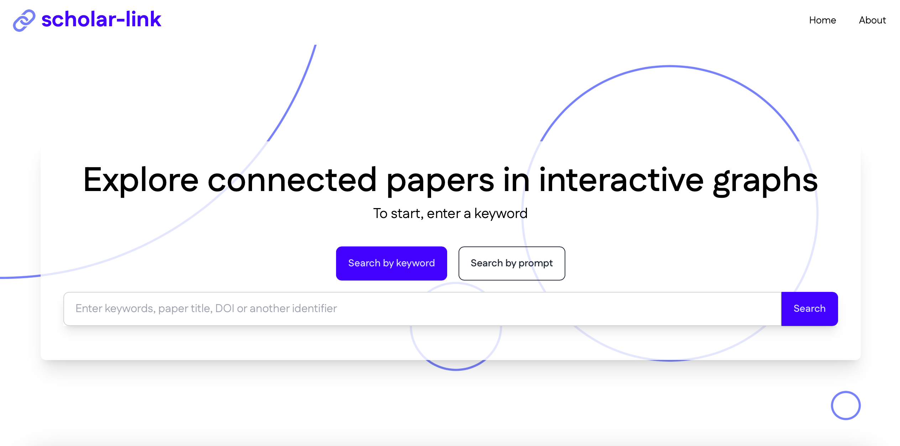
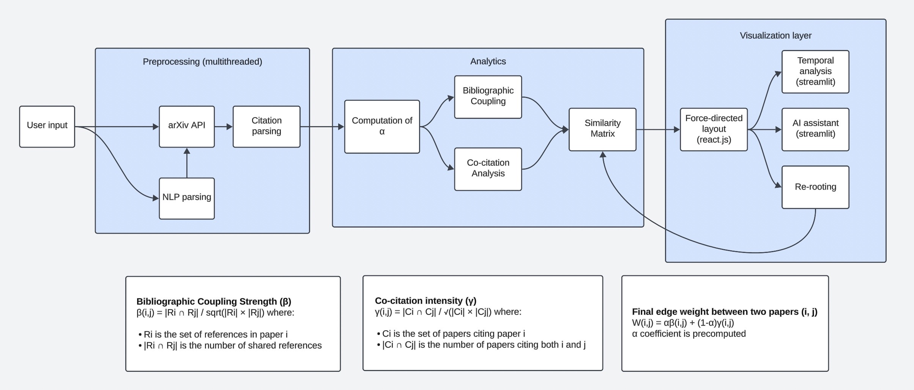
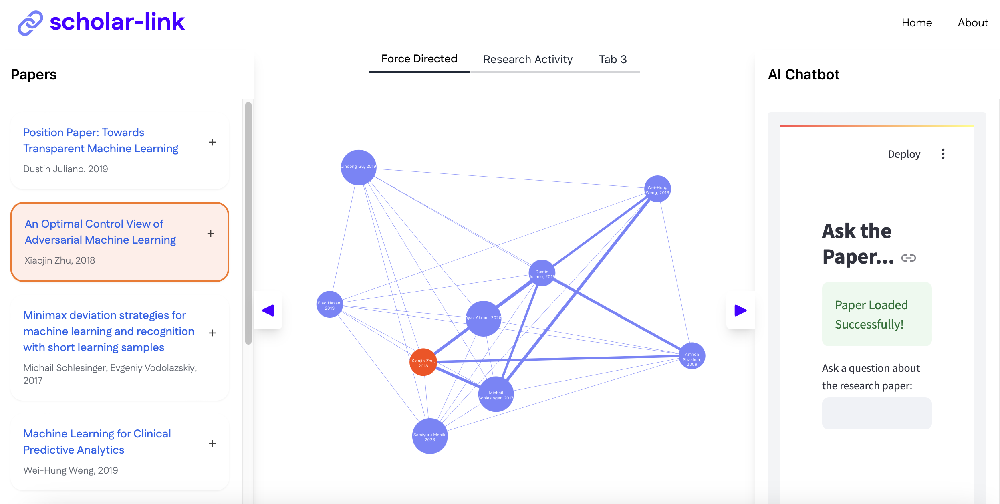

# Scholar Link -- Explore Connected Papers

_Hack the Valley 9._



## Background

<div style="display: flex; align-items: center; padding: 10px;">
    <div style="flex: 1; padding-right: 10px;">
        <p>Research can be overwhelming. Our app revolutionizes the research process by leveraging cutting-edge AI to visualize connections between papers in a <em>force-directed graph</em>. This groundbreaking approach empowers researchers to effortlessly uncover intricate relationships, spot emerging trends, and gain profound insights that were previously hidden. By transforming complex data into intuitive visualizations, we are setting a new standard for academic research and discovery.</p>
    </div>
    <div style="flex: 1; text-align: center;">
        
    </div>
</div>

## Features

1. **Interactive Graphs**: Visualize paper connections through co-citation and bibliographic coupling.
2. **Trend Analysis**: Spot trends with keyword and activity analysis.
3. **AI Summarization**: Get concise summaries of papers.
4. **AI Chatbot**: Ask questions and get answers about research papers.
5. **Diverse Data**: Access a wide range of papers from open-source databases.

## Tech Stack



1. **NLP**: KeyBert and Hugging Face for content analysis and summaries.
2. **Graph Theory**: Advanced algorithms for optimized graphs.
3. **Front-end**: React.js for a smooth user experience.
4. **Back-end**: Flask and Python for data handling and AI integration.
5. **Data Collection**: Web scraping tools for academic databases.
6. **Streamlit**: Fast deployment for dynamic diagrams and AI ChatBot.

## Usage

### Requirements

You must install the following dependencies and libraries for frontend/backend:

```
cd frontend
npm install
pip install -r requirements.txt
```

### Service

The web-app requires front-end and back-end hosting as well as 3 Streamlit app instances. To simplify the process, we created a shell script that automates the setup:

```
./init_services.sh
```

> If the error `permission denied: ./init_services.sh` occurs, run the command `chmod +x ./init_services.sh`

### Guide



Start from the home page, enter a keyword or prompt, and get a list of related papers. Select one paper as the root node and view a force-directed graph showing connections to related nodes. You can click on a paper to view detailed information including summary or chat with an AI Chatbot to ask specific questions about the content for additional insights.

_By following these steps, you can efficiently navigate through research literature and gain valuable insights._

## Next Steps

- Expand database coverage.
- Optimize algorithms for larger datasets.
- Add personalized recommendations.
- Develop collaboration features.
- Create APIs for integration.
- Explore applications beyond academia.

## Contact Us

- [Jet Chiang](www.linkedin.com/in/jet-chiang)
- [Eddy Zheng](https://www.linkedin.com/in/eddy-zheng-4749072b3/)
- [Chi McIssac](https://www.linkedin.com/in/chimcisaac/)
